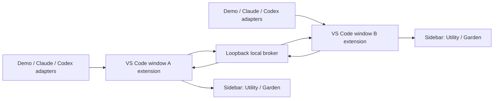

# Agent Garden Build Plan

## 1. Build Week Goal

Ship a judge-testable VS Code developer tool that answers one question:

> Which CLI coding agent needs my attention right now, and how do I jump back to it?

The demo must show multiple VS Code windows, multiple Claude/Codex terminal sessions, four normalized attention states, and click-to-focus navigation.

## 2. Product Contract

### Four top-level states

| State | Meaning | Example reasons |
| --- | --- | --- |
| `working` | The agent is actively processing or executing | generating, running command |
| `needsYou` | Human action is required | input, permission, error |
| `done` | The last task completed | completed, terminal closed after success |
| `unknown` | The state cannot be confirmed | no adapter, stale heartbeat, low-confidence inference |

`error` is a reason under `needsYou`. Confidence is separate from state: `confirmed`, `inferred`, or `unknown`.

### Required user flows

1. Install a prebuilt VSIX.
2. Open two VS Code windows.
3. Start Agent Garden Demo in each window, or run supported CLI agents.
4. See all sessions grouped by `Needs You`, `Working`, `Done`, and `Unknown`.
5. Click a session to reveal its originating workspace and terminal.
6. Switch between Utility and Garden presentation modes.

## 3. Hackathon MVP

### Must ship

- A TypeScript VS Code extension.
- Current-window terminal discovery using the stable VS Code API.
- Claude and Codex agent classification where observable.
- A normalized session and state model.
- Cross-window registry through a loopback-only local broker.
- A compact sidebar Webview View.
- Utility Mode and a lightweight Garden Mode using the same data.
- Click-to-focus for the originating terminal, with best-effort cross-window activation.
- Notifications for transitions into `needsYou` and `done`.
- Deterministic Demo Mode that requires no agent login or API key.
- Unit tests for state normalization, stale sessions, and broker messages.
- A packaged VSIX and clear installation/testing instructions.

### Explicit non-goals

- Launching or orchestrating agents.
- Git worktree management.
- Diff/code review.
- Token or cost analytics.
- Mobile or web dashboard.
- A standalone desktop application.
- Rich pet animation or progression systems.
- Reading arbitrary terminal history or claiming unsupported state certainty.

## 4. Architecture



### Extension responsibilities

- Enumerate terminals in its own VS Code window.
- Assign stable in-memory terminal IDs and a persisted window instance ID.
- Listen for shell-integration command start/end events.
- Accept normalized hook/adapter events.
- Publish session heartbeats to the broker.
- Execute focus commands targeted at its own terminals.
- Render the combined broker snapshot.

### Broker responsibilities

- Bind only to `127.0.0.1`.
- Let the first extension instance become broker owner; other windows connect as clients.
- Keep an in-memory registry of windows and sessions.
- Expire stale sessions using heartbeats.
- Route focus requests to the owning extension instance.
- Expose no remote network interface and store no prompts or terminal output.

For the MVP, use Node's built-in HTTP APIs plus short polling. Avoid WebSocket and native dependencies unless the basic route proves insufficient.

### Adapter responsibilities

- Convert tool-specific or demo events into the canonical session schema.
- Declare whether each state is confirmed or inferred.
- Never scrape or persist prompt contents.

```ts
type AttentionState = 'working' | 'needsYou' | 'done' | 'unknown';
type Confidence = 'confirmed' | 'inferred' | 'unknown';

interface AgentSession {
  sessionId: string;
  windowId: string;
  terminalId: string;
  workspaceName: string;
  agent: 'claude' | 'codex' | 'opencode' | 'demo' | 'unknown';
  state: AttentionState;
  reason?: string;
  confidence: Confidence;
  updatedAt: number;
}
```

## 5. Repository Layout

```text
AgentTool/
├─ src/
│  ├─ extension.ts
│  ├─ core/
│  │  ├─ types.ts
│  │  ├─ state-machine.ts
│  │  └─ session-registry.ts
│  ├─ terminal/
│  │  ├─ discovery.ts
│  │  └─ focus.ts
│  ├─ adapters/
│  │  ├─ adapter.ts
│  │  ├─ shell-adapter.ts
│  │  └─ demo-adapter.ts
│  ├─ broker/
│  │  ├─ server.ts
│  │  ├─ client.ts
│  │  └─ protocol.ts
│  └─ view/
│     ├─ provider.ts
│     └─ assets/
├─ test/
├─ docs/
├─ media/
├─ package.json
├─ tsconfig.json
├─ esbuild.mjs
├─ README.md
├─ LICENSE
└─ project.md
```

## 6. Implementation Sequence

### Milestone 0 — Scaffold and package

- Initialize Git and a TypeScript VS Code extension.
- Add esbuild, linting, unit tests, and VSIX packaging scripts.
- Register the sidebar view and commands.

Acceptance: extension launches in an Extension Development Host and renders an empty view.

### Milestone 1 — One-window vertical slice

- Enumerate current terminals.
- Detect observable `claude` and `codex` shell executions.
- Normalize sessions into the four states.
- Render Utility Mode.
- Focus a terminal on click.

Acceptance: one VS Code window can show and focus at least two demo/real sessions.

### Milestone 2 — Deterministic Demo Mode

- Add commands to start, advance, and reset demo sessions.
- Exercise all states and confidence badges.
- Ensure the demo works without API keys or external CLIs.

Acceptance: a judge can see the complete product loop within 30 seconds.

### Milestone 3 — Cross-window broker

- Start or connect to the loopback broker.
- Publish window/session heartbeats.
- Merge snapshots across windows.
- Route focus requests to the owning extension.

Acceptance: two VS Code windows display the same combined session list; a focus command reaches the correct owner.

### Milestone 4 — Garden presentation and notifications

- Add small CSS-only state characters/animations.
- Add Utility/Garden toggle.
- Notify only on transitions into `needsYou` or `done`.

Acceptance: both modes use identical session data and notifications do not repeat on every heartbeat.

### Milestone 5 — Reliability and submission packaging

- Test stale heartbeat cleanup, broker restart, duplicate sessions, and state transitions.
- Add diagnostics and a visible broker/adapter status.
- Package a VSIX.
- Write installation, supported-platform, demo, architecture, privacy, and troubleshooting docs.

Acceptance: a clean VS Code profile can install the VSIX and run Demo Mode without rebuilding.

## 7. Time-Critical Cut Line

Build in this order and stop adding features when the remaining submission work needs the time:

1. Working extension and empty sidebar.
2. Demo Mode and four states.
3. Current-window focus.
4. Cross-window registry.
5. Cross-window activation.
6. Garden Mode polish.

If cross-window OS activation is unreliable, keep broker routing working, label activation as best-effort, and demonstrate the supported Windows path honestly. Never sacrifice the installable VSIX, README, or video for extra animation.

## 8. Verification Matrix

| Scenario | Expected result |
| --- | --- |
| New terminal starts Claude/Codex | Session appears with observable confidence |
| Demo session requests permission | Moves to `needsYou` and notifies once |
| Demo session completes | Moves to `done` and records completion time |
| Adapter heartbeat stops | Moves to `unknown` after timeout |
| User clicks local session | Correct terminal is revealed and focused |
| User clicks other-window session | Command is routed to owning extension instance |
| Broker owner window closes | Another instance recovers or shows an actionable degraded state |
| Extension restarts | Stale sessions are not presented as confirmed working |

## 9. Submission Checklist

- Developer Tools category selected.
- Working project matches the demo video.
- Public or unlisted YouTube video is under three minutes and includes voiceover.
- Voiceover explains the project, Codex use, and GPT-5.6 use.
- Repository is public with a license, or shared with the required judging accounts.
- README documents installation, supported platforms, Demo Mode, and Codex/GPT-5.6 collaboration.
- Prebuilt VSIX is attached to a release or otherwise directly downloadable.
- Primary Codex build task's `/feedback` session ID is recorded.
- Devpost entry is marked Submitted rather than Draft before the deadline.

## 10. Immediate Next Action

Begin Milestone 0, then implement Demo Mode before any real-agent hook integration. Demo Mode is the guaranteed judging path; real adapters enhance the submission but must not be allowed to block it.
